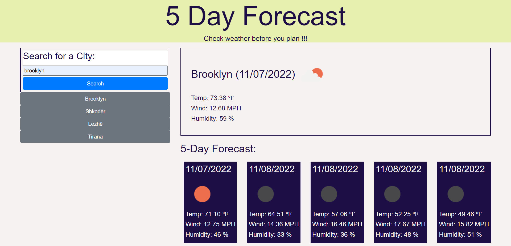

# 5-day-forecast

## Table of Contents

* [Description](#description)
* [Usage](#usage)
* [References](#References)
* [Credits](#credits)
* [License](#license)

## Description

5 Day Forecast website is application that allows a user to see the weather outlook for multiple cities. User search for a city name and will view future weather conditions for that city for current day and 5 day forecast. Displays the date, an icon representation of weather conditions, the temperature, the wind speed, and the humidity. Used [Moment.js](https://momentjs.com/) library to work with date and time. Used [Open Weather Map API](https://openweathermap.org/api) to retrieve weather data for cities.

     
## Usage

* Navigate to [5 Day Forecast](https://alkidavaci.github.io/5-day-forecast/) to view the web page 
* [5-day-forecast](https://github.com/alkidavaci/5-day-forecast) in GitHub.

## References
1. [5 Day Weather Forecast](https://openweathermap.org/forecast5)
2. [Full-Stack Blog on how to use API keys](https://coding-boot-camp.github.io/full-stack/apis/how-to-use-api-keys).
3. [Moment-js](https://momentjs.com/) 

## License

